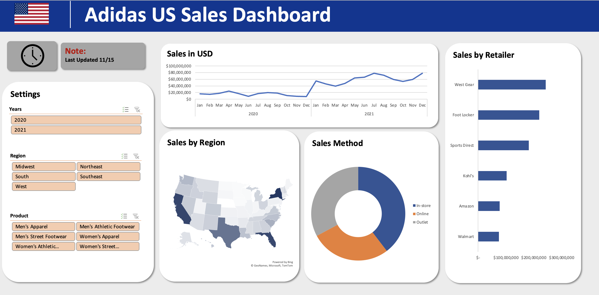

# 📊 Excel Projects
## 📚 Table of Contents
- [Adidas Dashboard](#adidas-dashboard)
- [Coca-Cola Dashboard](#coca-cola-dashboard)
- [Home Luxury Kitchen Dashboard](#home-luxury-kitchen-dashboard)

# Adidas Dashboard
### Description: This project main aim was to provide a dashboard that could help the marketing team to understand better how sales was distributed across states, how each retailers contribute to their sales and how the sales were done (online, outlet or in-store) and it provide informations on the trend of sales each year for each respective products. This dashboard gives a better understanding of their sales performance and also gives a better insight on actionable acts that can be taken in the future to improve sales. As shown below, the dashboard is dynamic so that we can judge our sales performance based on a more specific variable. This diminishes the possibility of misleading insight.
### Functions and Tools: Pivot Table, Charts, Maps and Slicers

# Coca-Cola Dashboard
### Description: Dashboard provided could be use to show shareholders on the performance of their company. This dashboard also provide information on sales of each products and trends within respective months selected. This project provide the same benefits as Adidas dashboard since the feature shown on this visualization has similar features. This dashboard makes use of slicers therefore the charts can be adjusted to obtain better insights on sale performance of each product across the country.
### Functions and Tools: Pivot Table, Charts, Maps and Slicers

# Home Luxury Kitchen Dashboard
### Description: Home Luxury Kitchen is a company that sells kitchen equipment and we are asked to make a dashboard that summarise sales for 2022 only. Analysing data from scratch was done to answer questions on sales and visualize results for ease of explanations. Dashboard provided could show sale performance for each product and trends on customer preferences in each selected state or year.
### Functions and Tools: Pivot Table, Charts, Maps, Slicers, Data Validation, IF, SUMIFS, TRANSPOSE, LARGE and INDEX

