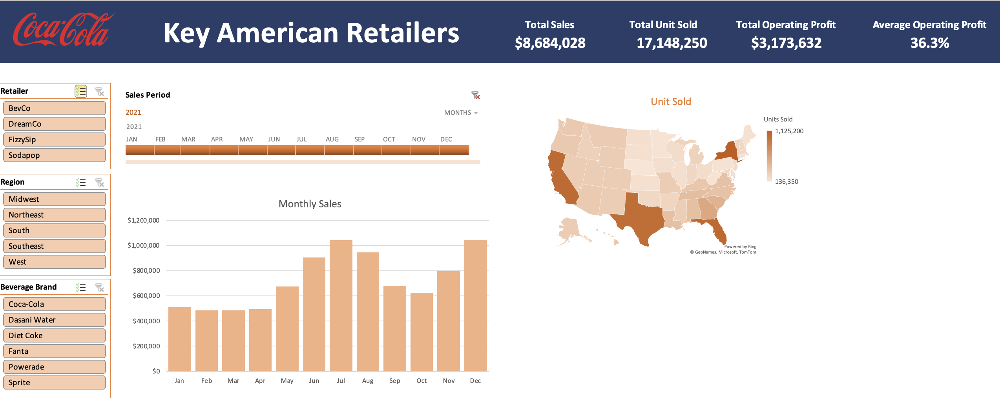

# 📊 Excel Projects
## 📚 Table of Contents
- [Adidas Dashboard](#adidas-dashboard)
- [Coca-Cola Dashboard](#coca-cola-dashboard)

# Adidas Dashboard
### Description: This project main aim was to provide a dashboard that could help the marketing team to understand better how sales was distributed across states, how each retailers contribute to their sales and how the sales were done (online, outlet or in-store) and it provide informations on the trend of sales each year for each respective products. This dashboard gives a better understanding of their sales performance and also gives a better insight on actionable acts that can be taken in the future to improve sales. As shown below, the dashboard is dynamic which means that we can judge our sales performance based on a more specific variable. This diminished the possibility of misleading insight.

### Functions and Tools: Pivot Table, Charts, Maps and Slicers

# Coca-Cola Dashboard
### Description: Dashboard provided could be use to show shareholders on the performance of their company. This dashboard also provide information on sales of each products and trends within respective months selected. This project also has the same benefits as the Adidas dashboard as the feature shown on this visualization has similar features.

### Functions and Tools: Pivot Table, Charts, Maps and Slicers

<!--- # SQL --->
<!--- Check out my projects and queries that uses  --->
<!--- Functions: Joins, Aggregations, Window Functions, CASE WHEN statements, Subqueries, Nested Subqueries, DATETIME Functions, Data Type Conversion, Text and String Manipulation --->

